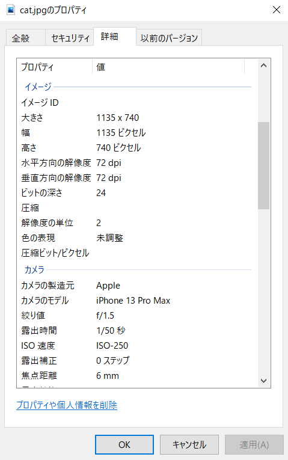
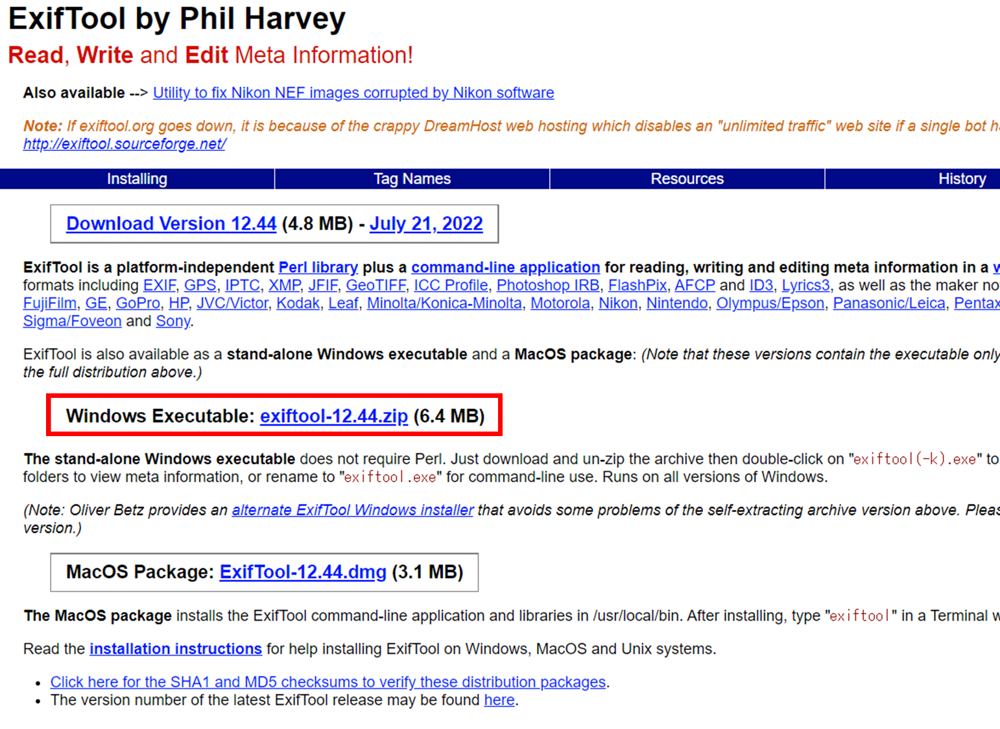
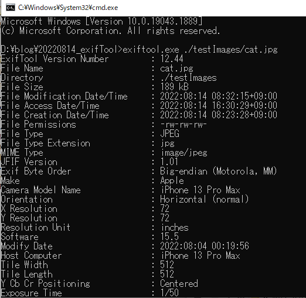
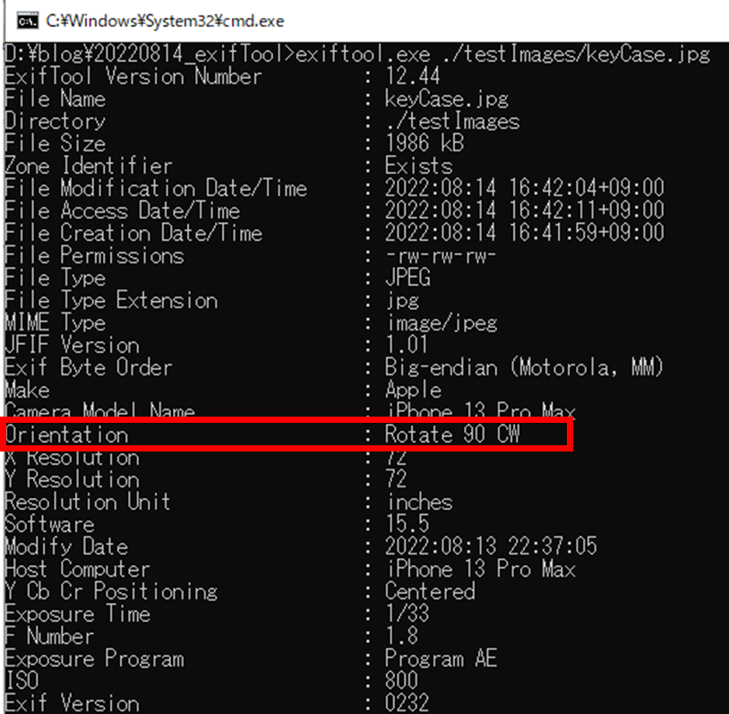
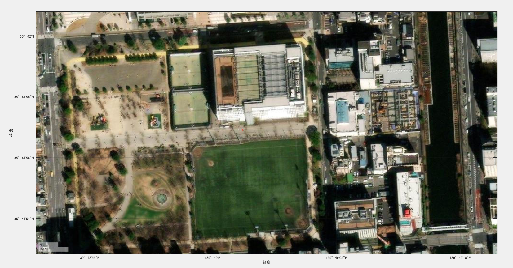
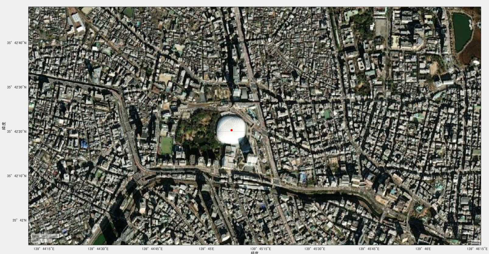

# exiftoolを用いて写真の位置情報を変更してみよう

この記事では、exiftoolを用いて、動画や画像のメタ情報の閲覧や、編集を行う方法について述べます。

# 画像のメタ情報の例

Windowsで画像上を右クリックし、プロパティを表示させると、以下のように画像の情報（例：画像のピクセル数やカメラ名、カメラの焦点距離）が確認できます。より詳しい情報を知りたい場合や、それらの情報を更新したい場合にはexiftoolが便利です。このページでは、exiftoolsを用いて、画像のメタ情報を読み込み、さらに、その位置情報を更新する方法について述べます。



# exiftoolのダウンロードについて

以下のページからexiftoolをダウンロードすることができます。

https://exiftool.org/

私はWindowsを用いているので、赤枠で示される、Windows用の実行ファイルをダウンロードしました。



exiftoolの使い方に関しては、以下のページが参考になりました。

ExifTool.exe の簡単な使い方 － 表示編

[https://kokufu.blogspot.com/2010/12/exiftool.html](https://kokufu.blogspot.com/2010/12/exiftool.html)

ExifTool.exe の簡単な使い方 － 編集編

[https://kokufu.blogspot.com/2010/12/exiftool_04.html](https://kokufu.blogspot.com/2010/12/exiftool_04.html)

# exiftoolを使ってみる

以下の画像でexiftoolを試してみようと思います。はじめに、実行ファイルの名前を`exiftool.exe`に変更しました。


コマンドは、以下の通りです。コマンドプロンプトから実行します。

```matlab:Code
exiftool.exe ./testImages/cat.jpg
```

撮影したカメラ（iPhone 13 Pro Max）の名前や、ファイルサイズなどの基本的な情報が確認できます。

画面を下にスクロールするとさらに詳しく情報をみることができます。

より詳しい使い方については、以下のページが参考になりました。

http://pen.envr.tsukuba.ac.jp/\textasciitilde{}torarimon/?EXIF%BE%F0%CA%F3%A4%CE%CA%D4%BD%B8



# 画像を撮影した時の向きを確認する

横向き、縦向きなどの、orientationの情報を確認します。orientationについての説明は以下のページがわかりやすかったです。

[https://qiita.com/yoya/items/4e14f696e1afd5a54403](https://qiita.com/yoya/items/4e14f696e1afd5a54403)

別の画像で同様のコマンドを用います。用いた画像は以下の通りです。

```matlab:Code
exiftool.exe ./testImages/keyCase.jpg
```


以下が結果になります。



orientationの値が、Rotate 90 CWになっていることがわかります。これは、時計周りに90度回転という意味だそうです。

以下のページが参考になりました。

[http://dqn.sakusakutto.jp/2009/02/jpegexiforientaion.html](http://dqn.sakusakutto.jp/2009/02/jpegexiforientaion.html)

  
## 位置情報を更新してみる

最後に、exiftoolを用いて、exif情報の更新を行います。

例えば、以下のような、東京都墨田区の名誉区民顕彰コーナー 王貞治のふるさと墨田の画像を用います。


墨田区の錦糸公園付近で撮影されましたが、うまくexif情報に反映されていることを確認します。

以下はMATLABコードです。imfinfoを用いて、画像の位置情報を取り出すことができます。

```matlab:Code
metainfo = imfinfo('./testImages/ohMusium.jpg');
lat_dms = metainfo.GPSInfo.GPSLatitude;
lat = dms2degrees(lat_dms);
lon_dms = metainfo.GPSInfo.GPSLongitude;
lon = dms2degrees(lon_dms);
figure;geoscatter(lat,lon,30,'red','filled')
geobasemap 'satellite'
geolimits('auto')
```

度分秒(**DMS**)単位を度単位に変換しています。`dms2degrees`関数を用いて変換しています。

以下のページがわかりやすかったです。

[https://meria21.hamazo.tv/e7882429.html](https://meria21.hamazo.tv/e7882429.html)

画像中央の赤点で示されているように、確かに錦糸公園内で撮影されていることが確認できます。



次に、以下のサイトから、東京ドームの経度緯度を検索し、以下のコマンドで経度緯度の情報を更新します。

[https://mapfan.com/spots/SC3A3,J,6](https://mapfan.com/spots/SC3A3,J,6)

```matlab:Code
exiftool.exe -gpslatitude=35.7056232 -gpslongitude=139.751919 ./testImages/ohMusium.jpg
```

同様のコードで、地図上に可視化した時の結果です。東京ドームの中央に赤点が示されており、画像中の位置情報を更新することができました。


# まとめ

この記事では、exiftoolの簡単な使い方を紹介しました。位置情報を更新する前後で、地図上の位置が確かに変化しており、正しくコマンドが動作していることが確認できました。exiftoolによって、多くの情報が取得できるため、今後も継続して勉強していきたいと思います。
